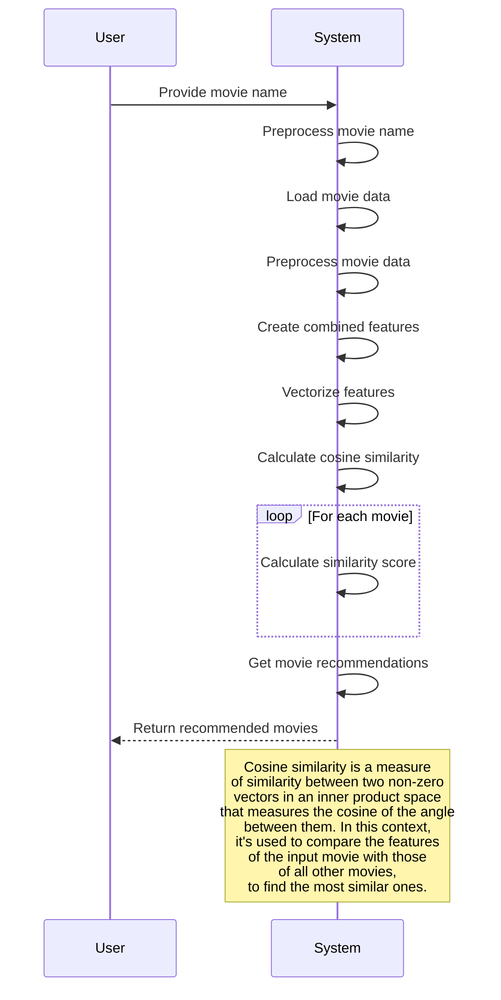

# Recommendation Engine Algorithm

The algorithm implements a content-based recommendation system for movies.

**Steps:**

1. User Input: The user provides the name of a movie they are interested in.
2. Preprocessing Movie Name: The system likely cleans the movie name (removing special characters, standardizing the format, etc.) to ensure accurate matching within the movie data.
3. Load Movie Data: The system loads a database containing information about various movies.
4. Preprocess Movie Data: The system preprocesses the data extracted from the database, potentially cleaning it, structuring it, or deriving specific features (e.g., keywords from movie descriptions, genre information, etc.).
5. Create Combined Features: The system combines different features from the movie data into a single representation for each movie.
6. Vectorize Features: The system transforms the combined features into numerical vectors, which can be mathematically compared.
7. Calculate Cosine Similarity (Loop):
8. For each movie in the database, the system calculates the cosine similarity between its vector representation and the vector representation of the user's input movie.
9. Cosine similarity measures how "aligned" two vectors are, with values closer to 1 indicating strong similarity and closer to 0 meaning less similarity.
10. Get Movie Recommendations: The system likely sorts the similarity scores and selects the top few movies as recommendations.
11. Return Recommendations: The system displays the list of recommended movies to the user.

